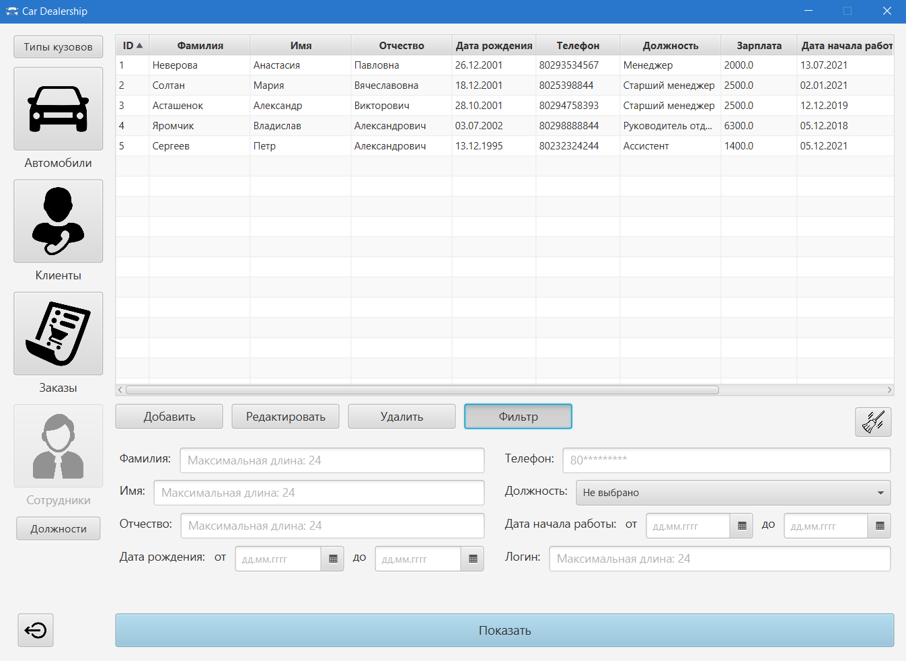

# The program of Car Dealership
JavaFX Desktop Application with MySQL as RDBMS.

## How to install

To restore the database, you need to create a database by entering the command `CREATE DATABASE dealership`, then register  
`mysql -uROOT -pPASSWORD -f dealership < dealership.sql`. Instead of `ROOT` should be your server username, instead of `PASSWORD` your server password, 
and instead of `dealership.sql` your path to the `dealership.sql` file.  

Then you need to go to `src/main/resources/` folder and create a `database.properties` file there, in which you write the following:

```
# DB Properties
db.url=jdbc:mysql://localhost/dealership
db.username=root
db.password=password
```
where `root` is your server username and `password` is your server password.

<b>Done.</b> To log in to the application as an administrator, you must enter the username `admin` and password `admin`.

## Image


